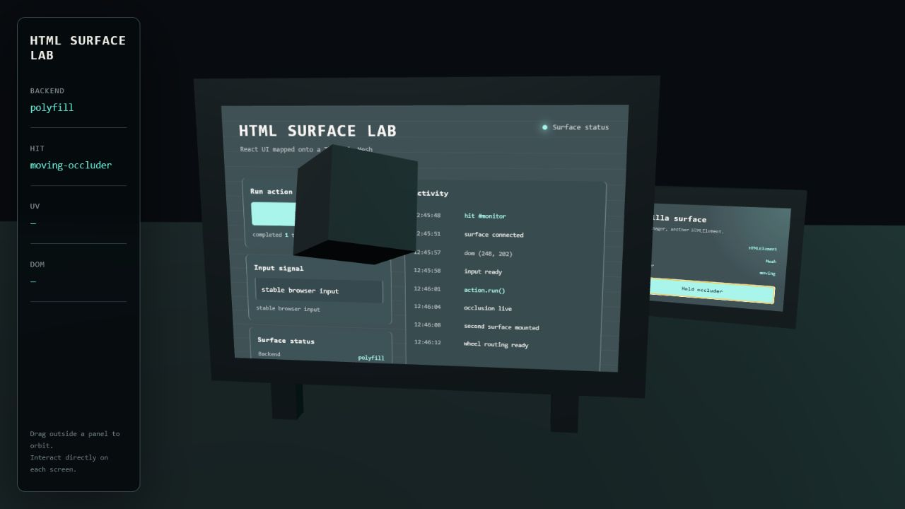
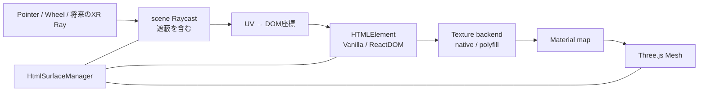

# HTML Surface Three

HTMLElementを任意のThree.js Meshへ関連付け、表示と入力を一つの単位で扱う実験的ライブラリです。現在は設計検証用の`0.0.0`プロトタイプで、公開APIは今後変更されます。



## HTML Surfaceとは

**HTML Surface**は、HTMLElementを描画ソース、Three.js Meshを表示対象として、次を一つの単位で管理する抽象化です。

- HTML由来Textureの生成と更新
- Textureを適用するMaterialとmap property
- Mesh交差点のUVからDOM座標への変換
- ブラウザのhit testingを再利用する入力ルーティング
- scene内の別Meshによる表示・入力の遮蔽
- DOM、Texture、イベント、Material／Geometryのライフサイクル

単なるHTML Textureではありません。HTML-in-Canvas、Three.js `HTMLTexture`、`three-html-render`は、交換可能な描画バックエンドまたは低レベル基盤として扱います。

## プロトタイプでできること

- ReactまたはVanilla HTMLで作ったUIをPlaneを含む任意MeshのMaterialへ適用
- 3D空間上からbutton、text input、scroll領域を操作
- RaycastのUVとTexture transformをDOMピクセル座標へ反映
- UIより手前の通常Meshを最前面hitとして扱い、表示と入力を同時に遮蔽
- 一つのmanagerで複数のHTML Surfaceを登録・切り替え
- Surface破棄時にMaterialの元のmapを復元
- native HTML-in-Canvas検出と、stableブラウザ向け`three-html-render` polyfillへの切り替え
- Three.js r185とpolyfill 0.1.2間のupload signature差をbackend内で吸収

コアはVanilla TypeScriptです。Reactは通常の`HTMLElement`を生成する利用例としてだけ使っています。

将来は`HTMLImageElement`と`HTMLVideoElement`を同じSurface管理へ渡し、単独メディアではThree.jsの画像／動画Textureを直接使い、テキストやフォームとの合成時だけHTML描画backendを使う方針です。メディア対応のためにMesh関連付け、UV変換、遮蔽、ライフサイクルを作り直さない境界を維持します。



## 実行方法

必要環境はNode.js `^20.19.0`または`>=22.12.0`です。

```bash
git clone git@github.com:solu199/html-surface-three.git
cd html-surface-three
npm install
npm run dev
```

表示されたURLをChrome、Edgeなどの現行stable Chromiumブラウザで開きます。デモでは次を確認できます。

1. 中央モニターのReact製`Run action`、入力欄、Activityスクロールを操作する
2. 右側のVanilla Surfaceで遮蔽物の移動を停止・再開する
3. 立方体が前面にある間、背後のUIをクリックできないことを確認する
4. パネル以外をdragしてOrbitControlsで視点を変える

検証とbuild:

```bash
npm test
npm run typecheck
npm run build
npm run preview
```

- library出力: `dist/`
- demo出力: `dist-demo/`

## Vanilla APIの使用例

```ts
import * as THREE from 'three';
import { HtmlSurfaceManager } from 'html-surface-three';

const manager = new HtmlSurfaceManager({
  renderer,
  camera,
  scene,
});

const element = document.createElement('div');
element.style.width = '640px';
element.style.height = '420px';
element.innerHTML = `
  <button type="button">Run action</button>
  <input aria-label="Signal" />
`;

const surface = manager.add({
  id: 'monitor',
  element,
  mesh: monitorMesh,
  mapProperty: 'map',
  transformUv(uv, texture) {
    // repeat / offset / rotationを入力座標にも反映する。
    texture.transformUv(uv);
  },
});

function frame() {
  manager.update(); // 移動するcamera、Mesh、遮蔽物へ追従
  renderer.render(scene, camera);
  requestAnimationFrame(frame);
}
frame();

// DOM更新を即座にTextureへ反映したい場合
surface.invalidate();

// Materialの元のmapを復元し、DOM / Texture / listenerを解放
surface.dispose();
manager.dispose();
```

`material`、`materialIndex`、`mapProperty`を指定すると、既存Meshの複数Materialや`emissiveMap`などにも関連付けられます。`disposeMaterial`と`disposeGeometry`はデフォルトで`false`で、利用者所有のresourceを勝手に破棄しません。

## Reactパネルの使用例

React専用adapterは不要です。Surfaceを先に登録してから、同じHTMLElementへ通常どおりmountします。

```tsx
import { createRoot } from 'react-dom/client';

const element = document.createElement('div');
element.style.width = '640px';
element.style.height = '420px';

const surface = manager.add({ element, mesh: monitorMesh });
const root = createRoot(element);
root.render(<ControlPanel />);

// cleanup
root.unmount();
surface.dispose();
```

## 現時点の制約

- 実ブラウザ検証は現行Chromiumのpolyfill経路が中心。Safari、Firefox、native HTML-in-Canvas経路は未検証
- `three-html-render`のSVG `foreignObject`経路に依存するため、CORS画像、動画、複雑なCSS、ブラウザ固有controlは完全ではない
- perspectiveで表示されたTextureと、操作中だけ一時整列するDOMは同じUV点を合わせる方式。Surface全体をCSS 3D変形しているわけではない
- pointer capture、drag、複数touch、IME composition、text selection、キーボードだけの操作は未完
- 最前面判定はscene全体へのrecursive Raycastで、大規模scene向けのlayer／BVH最適化は未実装
- SurfaceごとのUV channel、Geometry group単位のMaterial選択、skinned／instanced Meshは未検証
- backend判定とThree.js r185互換アダプタは隔離しているが、対応Three.js範囲は暫定で`>=0.184 <0.186`
- demo bundleは研究用で、code splittingやproduction向け軽量化を行っていない

## 既存ライブラリとの違い

- Canvas UIはライブHTMLへのWebGL表現が中心。本案は任意MeshとUIの関連付け・入力・遮蔽・破棄を中心にする
- Three.js `HTMLTexture`と`three-html-render`は描画primitive。本案はそれらをbackendとして使うSurface管理層
- Three.js `HTMLMesh`は簡易HTML rasterizer付きMesh。本案は既存Mesh／Materialを選び、scene全体の遮蔽を扱う
- Drei `Html`やBabylon.js HtmlMeshはDOM／CSS overlay方式。本案はTextureとしてMeshの変形・深度・遮蔽へ自然に参加する
- three-mesh-uiなどは3DネイティブUI。本案は既存のHTML、CSS、React資産を再利用する

詳細な根拠と互換性メモは[関連技術調査](docs/research/2026-07-24-html-surface-landscape.md)、設計判断は[プロトタイプ設計](docs/superpowers/specs/2026-07-24-html-surface-three-design.md)を参照してください。

## 今後追加すべき機能

1. Chrome native HTML-in-Canvas、Safari、Firefoxの互換性matrixとCapabilityReport
2. pointer capture、drag、touch、IME、selection、keyboard focusの統合test
3. Surface layer、対象object集合、BVHを使ったRaycast最適化
4. WebXR controller／hand rayを同じhit resolverへ渡す入力adapter
5. React Three Fiber向けの薄いhook／component。ただしVanilla coreは維持する
6. `ImageTexture`／`VideoTexture`系の直接backendと、HTML＋メディア合成backendを同じTexture handleへ収束
7. 静止画、動画、HTML操作パネルからの再生制御、HTML＋メディア合成の実行可能なexample
8. backend差し替えAPIの安定化と、3DネイティブUIなど別方式のfallback検討
9. UV channel、Geometry group、複数Material、curved／skinned／instanced Meshの検証
10. package公開前のAPI整理、semver方針、example追加、browser E2E

## 非目標

このリポジトリは、HTMLラスタライザー、UIコンポーネント集、DOMオーバーレイ、React専用ライブラリ、画像／動画decoder、メディアプレイヤーではありません。再生、停止、シーク、音声、autoplay制約はブラウザと既存のメディアAPIへ委ねます。

## 検証状況

- unit test: UV変換、Texture transformの非破壊適用、遮蔽を含む最前面選択、polyfill互換アダプタ
- browser: React button、input、scroll、Vanilla button、複数Surface、移動Meshによる遮蔽、遮蔽中のclick抑止
- responsive smoke test: 390×844でHUDと主Surfaceを確認
- build: strict TypeScript、library ESM、demo production build

ライセンスは未決定です。外部公開する前に追加してください。
