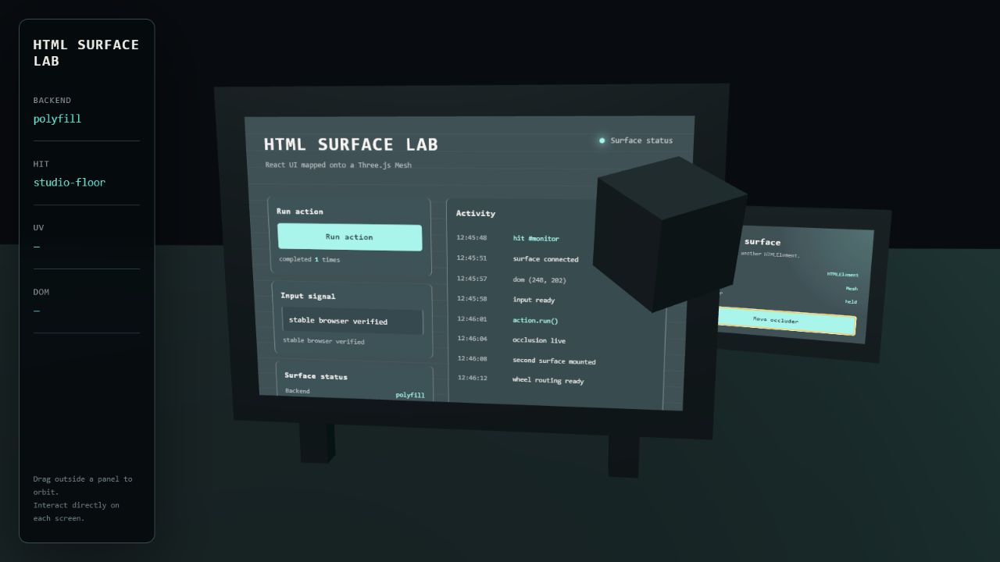
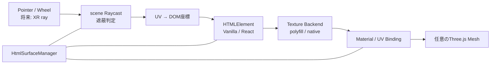

# HTML Surface Three

HTMLElementを任意のThree.js Meshへ関連付け、表示、入力、遮蔽、複数Surface、ライフサイクルを一つの単位で扱う実験的ライブラリです。`0.1.0-rc.1`はprivate GitHubリポジトリ内のリリース候補で、npmレジストリにはまだ公開していません。



## HTML Surfaceとは

**HTML Surface**は単なるHTML Textureではありません。HTMLElementを描画ソース、Three.js Meshを表示対象として、次を一単位で管理する抽象化です。

- HTML由来Textureの生成と更新
- Textureを適用するMaterial、Materialスロット、map property
- Raycast交差UVからDOM座標への変換
- 実DOMのbrowser hit testingを利用する入力ルーティング
- scene内の別Meshによる表示・入力の遮蔽
- DOM、Texture、listener、Material／Geometryの所有権と破棄

HTML-in-Canvas、Three.js `HTMLTexture`、`three-html-render`は交換可能な描画Backendまたは低レベル基盤として扱います。ライブラリの独自価値は、任意Meshへの関連付け、遮蔽を含む入力、複数Surface、ライフサイクルの協調管理にあります。



## 30秒で試す

必要環境はNode.js `^20.19.0`または`>=22.12.0`です。privateリポジトリへアクセスできる環境で実行します。

```bash
git clone git@github.com:solu199/html-surface-three.git
cd html-surface-three
npm install
npm run dev
```

表示されたURLをstable ChromeまたはEdgeで開いてください。中央の動くモニターにReact製サイト、右側にVanilla DOM製の別Surfaceが表示されます。button、navigation、input、checkbox、range drag、scroll、遮蔽の有効／無効を3D空間から操作できます。

## 実現できたこと

- Planeに限定せず、UVを持つ既存Meshと任意のMaterialプロパティへHTML UIを適用
- 同一MeshのMaterialスロットを区別し、Texture transformまたは独自UV変換を入力座標へ反映
- button、text input、checkbox、range、wheel／scroll、keyboard、composition、touchを3D空間から操作
- Pointer Captureを保持し、drag中にMesh外へ出ても操作を完了
- scene全体の最前面hitを使い、通常Meshによる遮蔽中は背後のSurfaceへ入力しない
- 動くMesh、Camera、遮蔽物を`manager.update()`で毎フレーム追跡
- 一つのManagerでReactとVanillaを含む複数Surfaceを管理
- Materialの元のmap、HTMLElementのstyle、Texture、observer、listenerを所有権に従って復元／破棄
- stable優先のpolyfill Backend、明示選択式native Backend、CapabilityReport、型付きエラー
- Chrome／Edgeの全E2E、Firefox／WebKit smoke、視覚回帰、tarball consumer検証

Reactは通常のHTMLElementを生成する利用例です。コアAPIはVanilla TypeScriptで、Reactへ依存しません。

## Vanilla API

```ts
import * as THREE from 'three';
import { HtmlSurfaceManager } from 'html-surface-three';

const panel = document.createElement('section');
panel.style.cssText = 'width: 640px; height: 420px';
panel.innerHTML = `
  <button type="button">Run action</button>
  <label>Signal <input aria-label="Signal" /></label>
  <div style="height: 120px; overflow: auto">...</div>
`;

const manager = new HtmlSurfaceManager({
  renderer,
  camera,
  scene,
  backend: 'auto',
});

const surface = manager.add({
  id: 'monitor',
  element: panel,
  mesh: monitorScreen,
  materialIndex: 0,
  mapProperty: 'map',
  transformUv(uv, texture) {
    texture.transformUv(uv);
  },
});

function frame() {
  manager.update();
  renderer.render(scene, camera);
  requestAnimationFrame(frame);
}
frame();

await surface.ready;
surface.invalidate();

// cleanup
surface.dispose();
manager.dispose();
```

`disposeMaterial`と`disposeGeometry`は既定で`false`です。利用者所有のThree.js resourceをライブラリが勝手に破棄しません。

## Reactパネル

React専用Adapterは不要です。同じHTMLElementへ通常どおりmountします。

```tsx
import { createRoot } from 'react-dom/client';

const element = document.createElement('div');
element.style.cssText = 'width: 640px; height: 420px';

const surface = manager.add({
  id: 'react-monitor',
  element,
  mesh: monitorScreen,
});
const root = createRoot(element);
root.render(<ControlPanel />);
surface.invalidate();

// Reactを先に停止する
root.unmount();
surface.dispose();
```

リポジトリの統合デモはDashboard／Activity／Settings navigation、状態更新button、input、checkbox、range、scrollを含むReactサイト全体を、移動・回転する3Dモニターへ表示します。

## Backend選択

| 指定 | 挙動 |
|---|---|
| `auto` | stable優先。native機能があってもpolyfillを選ぶ |
| `polyfill` | `three-html-render`を明示使用 |
| `native` | native HTML-in-Canvasが検出できる場合だけ使用。experimental |

Backend SPIは`html-surface-three/experimental`へ分離し、安定FacadeからThree.js実験APIを露出しません。詳細は[Texture Backend](docs/backends.md)を参照してください。

## ブラウザ保証

段階保証を採用しています。

- Tier 1: stable Chrome／Edgeで全E2Eシナリオ
- Tier 2: Playwright Firefox／WebKitで表示、button、input、scrollのsmoke
- Experimental: native HTML-in-Canvasの検出と明示選択

Playwright WebKitはSafariそのものではありません。Safari向け手動checklistを含む詳細は[ブラウザ互換性](docs/browser-support.md)にあります。

## 現時点の制約

- polyfillはSVG `foreignObject`とTexture uploadのコストを持つ
- CORS画像／動画、iframe、DRM、複雑なCSSやform controlの外観にはブラウザ制約がある
- UV重複、別UV channel、SkinnedMesh、InstancedMeshはRC1保証外
- scene全体へのrecursive Raycastは大規模sceneで最適化が必要
- DOMアクセシビリティツリーと3D上の視覚位置は必ずしも一致しない
- native HTML-in-Canvas、React Three Fiber Adapter、WebXR入力はまだstable APIではない

詳細と回避方針は[現時点の制約](docs/limitations.md)を参照してください。

## 既存ライブラリとの違い

- Canvas UIはライブHTMLのWebGL表現を提供します。本ライブラリは描画処理を低レベル基盤として扱い、任意MeshとのBinding、入力、遮蔽、複数Surface、破棄を一段上で管理します。
- Three.js `HTMLTexture`と`three-html-render`は描画primitiveです。本ライブラリでは交換可能なBackendとして隔離します。
- Three.js `HTMLMesh`は簡易rasterizer付きMeshです。本ライブラリは既存Mesh／Materialを対象にし、scene内の通常Meshを遮蔽物として扱います。
- Drei `Html`やBabylon.js HtmlMeshのようなDOM／CSS overlayではなく、TextureとしてMeshの変形、深度、遮蔽へ参加します。
- `three-mesh-ui`などの3DネイティブUIと異なり、既存のHTML、CSS、React資産を再利用します。

技術選定の根拠は[関連技術調査](docs/research/2026-07-24-html-surface-landscape.md)を参照してください。

## 今後追加すべき機能

1. 実Safariと複数OS／GPU／IMEの互換性matrix
2. Surface layer、Raycast対象root、BVHによる大規模scene最適化
3. React Three Fiber向けの薄いhook／component
4. WebXR controller／hand ray入力Adapter
5. 画像／動画TextureとHTML合成Backendの共通Surface管理
6. UV channel、Geometry group、curved／skinned／instanced Meshの検証
7. paint頻度、Texture解像度、Surface数のperformance budgetと計測
8. Backend SPIの実装結果に基づく安定化

## 開発・検証

```bash
npm run typecheck
npm test
npm run build
npm run test:e2e:tier1
npm run test:e2e:smoke
npm run test:e2e:evidence
npm run test:visual
npm run verify:package
npm run verify
```

- library ESMと型宣言: `dist/`
- production demo: `dist-demo/`
- E2E成果物: `artifacts/`
- `test:e2e:evidence`: 主要フローのvideo、trace、最終screenshot、HTML reportを保存
- `verify:package`: `npm pack`したtarballを一時consumerへinstallし、型とruntime exportを検査

ローカルtarballを別プロジェクトで試す場合:

```bash
npm run build:lib
npm pack
npm install /path/to/html-surface-three-0.1.0-rc.1.tgz three@0.185.1
```

## 文書

- [RC1設計](docs/superpowers/specs/2026-07-24-html-surface-three-rc1-design.md)
- [APIリファレンス](docs/api.md)
- [Texture Backend](docs/backends.md)
- [ブラウザ互換性](docs/browser-support.md)
- [現時点の制約](docs/limitations.md)
- [プロトタイプからの移行](docs/migration-rc1.md)
- [関連技術調査](docs/research/2026-07-24-html-surface-landscape.md)
- [変更履歴](CHANGELOG.md)

## 非目標

HTMLラスタライザー、UIコンポーネント集、DOMオーバーレイ、React専用ライブラリ、画像／動画decoder、メディアプレイヤーではありません。

## License

[MIT](LICENSE)
