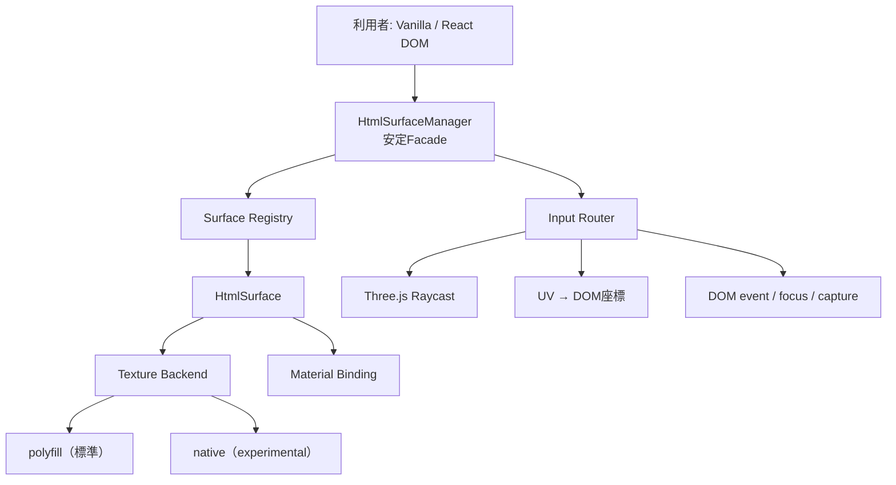

# HTML Surface Three 0.1.0-rc.1 設計

**状態:** 承認済み  
**対象バージョン:** `0.1.0-rc.1`  
**ライセンス:** MIT  
**公開方針:** private GitHubリポジトリ内のリリース候補。npmレジストリにはまだ公開しない。

## 1. HTML Surfaceの定義

**HTML Surface**とは、HTMLElementを描画ソース、Three.js Meshを表示対象として、テクスチャ生成、Materialへの適用、UV／DOM座標変換、入力ルーティング、遮蔽判定、ライフサイクルを一つの単位として管理する抽象化である。

HTML Surfaceは単なるHTML Textureではない。TextureはHTML Surfaceを構成する交換可能な描画結果の一つである。HTML-in-Canvas、Three.js `HTMLTexture`、`three-html-render`は、交換可能な描画バックエンドまたは低レベル基盤として扱う。本ライブラリの主語と公開概念はHTML Surfaceとする。

HTML Surfaceを任意Meshへ関連付ける責務には、次を含む。

- 対象Meshと、必要なら交差した子Meshを識別する
- 生成したTextureを適用するMaterialスロットとプロパティを選ぶ
- Materialの元の値を記録し、安全に復元する
- Three.jsのTexture transformと利用者指定変換を含め、交差UVをDOM座標へ写像する
- 表示対象より手前にある通常の3Dオブジェクトを入力の遮蔽物として扱う
- DOM、Texture、Material、Geometry、イベント購読の所有権と破棄順序を管理する

## 2. 目的

Vanilla APIを中核として、HTMLまたはReactで作ったUIをThree.jsの任意MeshへTextureとして表示し、3D空間からブラウザ由来の操作性を可能な限り維持する。

`0.1.0-rc.1`では次をリリース判定対象とする。

- 複数のHTML Surfaceを同一Managerで管理できる
- 任意Mesh、Materialスロット、Textureプロパティ、UV変換を指定できる
- 通常Meshを含むRaycast結果から遮蔽を考慮して入力先を決められる
- pointer、focus、keyboard、IME、wheel、scroll、drag、touchを一貫して扱える
- 動くMesh、Camera、遮蔽物へ毎フレーム追従できる
- Backendの選択と制約をCapabilityReportで確認できる
- 生成物を`npm pack`し、別プロジェクトから型付きで利用できる
- React製サイトを表示する動く3Dモニターの統合デモで、主要操作を検証できる

## 3. 非目標

本ライブラリは次を実装しない。

- HTMLラスタライザー
- ボタンやフォームなどのUIコンポーネント集
- DOMオーバーレイライブラリ
- ReactまたはReact Three Fiber専用ライブラリ
- Three.jsの特定リビジョンや実験APIを外部APIへそのまま露出するAdapter
- iframe、DRMメディア、クロスオリジン制約を回避する仕組み
- WebXRコントローラー入力の完成版
- DOMアクセシビリティツリーと3D上の視覚位置が完全に一致するという保証

React Three FiberとWebXRは将来の入力・ライフサイクルAdapterを追加できる境界を残すが、RC1の互換性保証には含めない。

## 4. 技術前提

- WICG HTML-in-Canvasは、RC1の必須実行経路として扱えるほど広くstableブラウザへ実装されていない。
- stableブラウザでは`three-html-render`を利用するpolyfill経路を標準とする。
- native HTML-in-Canvas経路は明示的な実験機能とし、既定の`auto`選択では使用しない。
- Three.js r185はRC1の開発・検証対象だが、r185固有クラスをコア全体へ拡散させない。
- DOMイベントを受ける実HTMLElementを保持し、keyboard、IME、form control、selectionなどは可能な限りブラウザへ委譲する。

参考:

- [WICG HTML-in-Canvas](https://github.com/WICG/html-in-canvas)
- [Chrome HTML-in-Canvas origin trial](https://developer.chrome.com/blog/html-in-canvas-origin-trial)
- [Three.js HTMLTexture](https://threejs.org/docs/pages/HTMLTexture.html)
- [three-html-render](https://github.com/repalash/three-html-render)

## 5. 採用アプローチ

### 5.1 薄い公開Facadeと交換可能な内部境界

採用案は、`HtmlSurfaceManager`と`HtmlSurface`を小さな安定Facadeとし、描画、Material適用、Surface検索、入力配送を内部の協調責務へ分ける「ハイブリッド・サーフェス層」である。



ここで示す内部名は責務を説明するための仮称である。プロトタイプ結果に応じ、過剰なクラス分割は関数や小さな状態オブジェクトへ簡略化してよい。安定化するのは外から観測できる振る舞いと所有権であり、内部クラス数ではない。

### 5.2 不採用案

- 現在のManager単体へ全機能を追加する案は、入力・描画・所有権が密結合になり、テストと将来のBackend交換が難しいため採用しない。
- 全責務を最初からプラグイン化する案は、RC1時点では拡張点が過剰で、未検証の抽象化を公開してしまうため採用しない。
- Three.js `InteractionManager`またはnative HTML-in-Canvasを中核とする案は、実験APIと単一平面前提への結合が強くなるため採用しない。

## 6. 公開API

### 6.1 安定Facade

利用例を次の形に保つ。

```ts
const manager = new HtmlSurfaceManager({
  renderer,
  camera,
  scene,
  backend: 'auto',
});

const surface = manager.add({
  id: 'monitor',
  element,
  mesh,
  materialIndex: 0,
  mapProperty: 'map',
  transformUv,
});

function frame() {
  manager.update();
  renderer.render(scene, camera);
  requestAnimationFrame(frame);
}

surface.invalidate();
surface.setEnabled(false);
surface.dispose();
manager.dispose();
```

RC1で安定扱いにする範囲:

- `HtmlSurfaceManager`
  - `add(options)`
  - `update()`
  - `getCapabilityReport()`
  - `dispose()`
- `HtmlSurface`
  - `id`
  - `element`
  - `mesh`
  - `enabled`
  - `invalidate()`
  - `setEnabled(enabled)`
  - `dispose()`
- Manager作成オプション
  - renderer
  - camera
  - sceneまたはRaycast対象root
  - Backend選択
  - 診断通知
- Surface作成オプション
  - id
  - HTMLElement
  - Mesh
  - MaterialまたはMaterialスロット
  - Texture適用プロパティ
  - UV変換
  - リソース所有権
  - 初期入力状態
- `CapabilityReport`
- `HtmlSurfaceError`と安定したエラーコード

実装検証で不自然な引数が判明した場合、RC1の公開前までは名前やまとめ方を簡略化してよい。ただし上記の能力と所有権を失わせない。

### 6.2 実験API

次はpackageの`experimental`サブパスへ置くか、RC1では非公開にする。

- Texture Backend SPI
- native HTML-in-Canvas Backend
- Three.js実験クラスへの直接Adapter
- React Three Fiber hook
- WebXR ray入力Adapter
- Input Routerの全面的な差し替え

標準エントリーポイントから実験APIを再exportしない。実験APIはsemver上の互換性保証対象外であることを明記する。

## 7. Texture Backend境界

BackendはHTMLElementからThree.js Textureを得る処理だけを担当する。Mesh検索、遮蔽、UV変換、DOM入力配送、Material所有権は担当しない。

概念上の最小契約は次である。

```ts
interface HtmlTextureBackend {
  readonly kind: 'polyfill' | 'native';
  mount(context: {
    element: HTMLElement;
    renderer: THREE.WebGLRenderer;
  }): HtmlTextureHandle;
}

interface HtmlTextureHandle {
  readonly texture: THREE.Texture;
  readonly ready: Promise<void>;
  invalidate(): void;
  dispose(): void;
}
```

実装上の規則:

- `auto`はRC1ではpolyfillを選ぶ
- `native`は利用者が明示した場合だけ選ぶ
- Backend初期化失敗は型付きエラーにする
- DOM変更、input、change、scrollなどによるinvalidateをBackendが監視できる
- `dispose()`後のinvalidateは安全なno-opとする
- 非同期描画中は最後に成功したTextureを維持し、失敗理由を診断へ通知する
- `three-html-render`やThree.jsの署名差分はBackend内で吸収する

画像や動画を単独で扱う将来のBackendも、このSurface管理層を再利用できる。ただしHTML Surfaceの定義を曖昧にしないため、RC1の公開BackendはHTMLElement向けに限定する。

## 8. Material BindingとUV変換

### 8.1 Material適用

Bindingは次を管理する。

- 対象Mesh
- `materialIndex`
- 実際のMaterial
- `map`など適用先プロパティ
- 適用前の値
- Surfaceが生成したTexture
- 利用者が明示した所有権

同じMaterialの同じTextureプロパティへ複数SurfaceをBindingしようとした場合は、黙って上書きせず競合エラーにする。

同一Meshへ複数のMaterialスロットがある場合、Raycast交差面の`face.materialIndex`を使ってSurfaceを解決する。単一Materialでは従来どおりMesh単位で解決する。

### 8.2 UV変換

座標変換は次の順序とする。

1. Raycast交差からUVを得る
2. UVをコピーし、元Geometryの値を変更しない
3. 利用者指定`transformUv`があれば適用する
4. なければTextureの標準transformを適用する
5. wrap、repeat、offset、rotation、flipYを反映した値を得る
6. `x = u * width`、`y = (1 - v) * height`を基準にDOM座標へ変換する

UVがない交差はそのSurfaceへ入力配送できない。表示は継続できるが、Capability／診断に`missing-uv`を記録する。

## 9. 入力ルーティング

### 9.1 通常時

画面座標から次の順序で入力先を決める。

1. Canvas内のclient座標をNDCへ変換する
2. sceneまたは指定rootを再帰Raycastする
3. `visible`、Material可視性、利用者指定ignore規則を評価する
4. 距離順で最前面の有効交差を選ぶ
5. 通常Meshなら入力は遮蔽される
6. Surface MeshならMaterialスロットとUVを解決する
7. UVをDOM座標へ変換する
8. 対応する実DOMをポインター位置へ整列させる
9. `document.elementFromPoint`で実際の子要素を特定する
10. 必要な最小限のイベント補助を行い、標準DOM動作へ委譲する

`manager.update()`は最後のポインター位置を毎フレーム再評価する。これにより、ポインターが停止していてもMesh、Camera、遮蔽物の移動へ追従する。

### 9.2 pointerdownとtouch

マウスではhover時点で実DOMがポインター下へ配置され、以降のイベントをブラウザが直接配送できる。touchやスタイラスのように事前hoverがない最初の`pointerdown`では、Canvas側でSurfaceとDOM targetを解決し、次を補う。

- focus可能要素へのfocus
- pointerdownセッションの開始
- 必要なDOM PointerEventの配送
- down/upが同一activation targetで完了した場合のclick

同じブラウザイベントを二重配送しないよう、元のtargetがSurface DOM内かCanvasかを区別する。

### 9.3 Pointer Captureとdrag

`pointerId`ごとに入力セッションを持つ。

- Capture開始前のdownは、遮蔽されていないSurfaceだけが受け取る
- targetがPointer Captureを要求した場合、move、up、cancelを同じtargetへ配送する
- Capture中は、一時的にMesh外へ出る、または遮蔽物が前を横切る場合でもセッションを継続する
- up、cancel、Surface無効化、Surface破棄、Manager破棄でCaptureを必ず解放する
- Captureしていないhover／moveは毎回Raycastし、遮蔽を再評価する

これによりrange input、独自slider、drag操作をブラウザに近い規則で扱う。

### 9.4 keyboard、focus、IME

keyboardとcompositionイベントは合成しない。実HTMLElementをfocusし、ブラウザから直接配送させる。

- pointer activation時に対象form controlをfocusする
- inactive Surfaceはpointer対象外にするがDOMとReact状態は保持する
- parked Surfaceが意図せずTab移動先にならないよう、active状態とfocus scopeを管理する
- Surface無効化または破棄時に、その内部へfocusがあれば安全な移動先へblur／focus移行する
- textarea、selection、IME変換中の値更新後にTextureをinvalidateする

### 9.5 wheelとscroll

- Surface DOMが実際のevent targetなら、ブラウザの標準scrollを優先する
- Canvasから開始したwheelは、DOM座標下で最も内側にあるスクロール可能要素へ適用する
- 内側で消費できない方向のscrollは、外側のスクロールコンテナへ伝播できる
- scroll後にTextureをinvalidateする
- Surfaceに当たらないwheelはOrbitControlsなどCanvas利用者へ残す

## 10. 複数Surfaceと遮蔽

ManagerはSurfaceを追加順ではなく、Raycast距離とMaterialスロットで解決する。

- Surface同士が重なった場合は最前面だけをactiveにする
- 通常Meshが前面なら全Surfaceをparkする
- `userData`またはManager optionでRaycast無視対象を指定できる
- 非表示Object、非表示Material、無効Surfaceは入力候補から外す
- 交差した子Meshから親へ辿り、登録Surfaceを見つけられる
- 同一Meshの別Materialスロットへ別Surfaceを関連付けられる

## 11. ライフサイクルと所有権

既定では、Managerが生成したTexture、Observer、イベントListenerだけをManager／Surfaceが所有する。

- HTMLElement、Mesh、Material、Geometryは利用者所有
- Surface破棄時は、MaterialプロパティがまだSurfaceのTextureを参照している場合だけ元の値へ戻す
- 利用者が後からMaterialを変更していた場合は上書きせず、診断を残す
- Material／Geometryを破棄するoptionは明示指定時だけ有効
- SurfaceとManagerの`dispose()`は冪等
- Manager破棄は全Surface、入力セッション、Observer、Canvas Listenerを解放する
- Surface破棄後の公開メソッドは、no-opにするものと型付きエラーにするものをAPI文書で区別する
- React rootは利用者が`unmount()`する。ライブラリがReactへ依存して破棄しない

## 12. エラーと診断

プログラミングエラーと実行時の一時状態を分ける。

### 12.1 型付きエラー

`HtmlSurfaceError`は安定した`code`を持つ。候補:

- `manager-disposed`
- `duplicate-surface-id`
- `material-not-found`
- `material-index-out-of-range`
- `material-binding-conflict`
- `invalid-map-property`
- `backend-unavailable`
- `backend-initialization-failed`
- `surface-already-disposed`

### 12.2 非throw診断

フレーム単位で起こり得る状態はthrowしない。

- `missing-uv`
- `zero-size-element`
- `occluded`
- `material-changed-externally`
- `paint-failed`
- `native-backend-experimental`

診断は最後の状態、Surface ID、Backend、対象Object名などを含むが、毎フレーム同じ警告をconsoleへ連続出力しない。

## 13. CapabilityReport

`manager.getCapabilityReport()`は、利用可能性と実際に選択された経路を区別して返す。

```ts
type CapabilityReport = {
  backend: {
    requested: 'auto' | 'polyfill' | 'native';
    active: 'polyfill' | 'native';
    nativeAvailable: boolean;
  };
  input: {
    pointerEvents: boolean;
    pointerCapture: boolean;
    wheel: boolean;
    touch: boolean;
    keyboard: true;
    ime: true;
  };
  rendering: {
    webgl: boolean;
    requiresUv: true;
  };
  warnings: readonly CapabilityWarning[];
};
```

keyboardとIMEの`true`は、実DOMを保持してブラウザへ委譲する設計能力を示す。全OS・全IMEの表示完全一致を保証する意味ではない。

## 14. stableブラウザ保証

段階保証を採用する。

| Tier | 対象 | RC1での保証 |
|---|---|---|
| Tier 1 | stable Chrome / Edge | polyfill Backendで全E2Eシナリオを実行 |
| Tier 2 | stable Firefox | 起動、表示、button、input、scrollのスモーク |
| Tier 2 | stable Safari | Playwright WebKitで自動スモーク、実Safari向け手動確認項目を文書化 |
| Experimental | native HTML-in-Canvas対応環境 | Capability検出と明示選択。互換性保証外 |

Playwright WebKitはSafariそのものではないため、結果を「Safari完全保証」と表現しない。ブラウザ、OS、GPU、font差分は互換性文書へ記録する。

## 15. 統合デモ

### 15.1 3Dモニター

- 画面、筐体、スタンドを持つモニター形状のThree.js Group
- Group全体が自動で平行移動、上下動、回転する
- アニメーション停止／再開ボタン
- カメラ用OrbitControls
- 画面前を横切る遮蔽Object
- 遮蔽物の表示、停止、位置を操作できるテストコントロール

### 15.2 Reactサイト

画面TextureのソースとしてReact製の小規模なサイトを表示する。

- Dashboard／Activity／Settingsのページ内navigation
- 状態が変わるbutton
- text input
- checkbox
- range inputまたはslider drag
- 複数行のscroll領域
- 操作結果と現在ページの表示

外部サイトをiframeで埋め込むのではなく、同一オリジンのReact DOMを利用する。これによりTexture化、focus、CORS、E2Eを制御可能にする。

### 15.3 Vanilla Surface

別MeshへVanilla DOMの診断パネルを表示し、次を確認する。

- 複数Surfaceの独立状態
- 別MaterialとUV変換
- buttonとscroll
- Surfaceの有効／無効切り替え

### 15.4 診断表示

開発用HUDに次を表示する。

- Backend
- Capability警告
- hit Object
- active Surface ID
- UV
- DOM座標
- focus target
- pointer capture状態
- 遮蔽状態

HUDはデモ専用で、安定公開APIには含めない。

## 16. テスト戦略

共有ロジック、入力状態、所有権は回帰リスクが高いためTDDで追加する。見た目だけの調整や文言変更には新規Unit testを要求しない。

### 16.1 Unit test

- Raycast結果の最前面選択と遮蔽
- 親子ObjectとMaterialスロットのSurface解決
- UVコピー、flip、repeat、offset、rotation、独自変換
- pointer sessionとcaptureの状態遷移
- pointercancelとdispose時の解放
- scroll対象と境界伝播
- Material Bindingの適用、競合、復元
- 所有権ごとのdispose
- 型付きエラー
- CapabilityReport

### 16.2 Integration test

- 複数Surfaceの追加、更新、削除
- Backendのmount、ready、invalidate、dispose
- DOM mutation、input、change、scrollからのinvalidate
- Materialを利用者が外部変更した場合の安全な破棄
- React状態更新後の再描画

### 16.3 Browser E2E

Tier 1の全シナリオ:

- moving monitor上のbutton
- navigation
- text input、keyboard、IMEの代替となるcomposition event確認
- wheel／scroll
- range drag
- touch PointerEvent
- 遮蔽中のdown拒否
- capture中のdrag継続
- 複数Surface切り替え
- Surface無効化／再有効化

Tier 2のスモーク:

- デモ起動
- React Surface表示
- button
- text input
- scroll
- CapabilityReport

視覚検証:

- animationを固定時刻で停止する
- 非遮蔽状態、遮蔽状態、別ページ状態のスクリーンショットを保存する
- 意図した変更だけをbaseline更新する
- E2E動画またはtraceをレビュー成果物として残す

## 17. RC1リリースゲート

次をすべて満たした場合だけ`0.1.0-rc.1`相当とする。

- `npm run typecheck`
- Unit／Integration test
- Tier 1 browser E2E
- Tier 2 browser smoke
- 視覚比較
- library build
- demo build
- `npm pack`
- 空のfixtureへtarballをインストールし、ESM importと型解決を確認
- package exportからprivateな内部モジュールへ依存していない
- MIT `LICENSE`
- `CHANGELOG.md`
- 日本語README
- API、Backend、互換性、制約、移行、実行方法、使用例の文書
- private GitHubのPRで差分とCI結果をレビューできる

npmレジストリへのpublish、GitHub Release、version tagのpushはRC1実装PRの必須操作には含めない。必要な成果物と手順は用意する。

## 18. プロトタイプからの移行

既存プロトタイプの利用例を可能な限り維持する。

- `new HtmlSurfaceManager(...)`
- `manager.add({ element, mesh })`
- `manager.update()`
- `surface.invalidate()`
- `surface.dispose()`

変更が必要な場合はREADMEと移行文書へ記載する。特に次は挙動が厳格になる。

- `backend: 'auto'`はstable優先でpolyfillを選ぶ
- 同一Materialプロパティの競合はエラー
- `materialIndex`は交差面のスロット解決にも使う
- dispose時は利用者による後続Material変更を上書きしない
- active Surfaceとpointer captureを明示的に管理する

## 19. 想定制約

- polyfillはSVG `foreignObject`やGPU uploadのコストを持つ
- CSS、form control、font、selectionの見た目はブラウザ差分を受ける
- クロスオリジン画像や動画はCORS制約を受ける
- iframe、DRM、保護コンテンツを完全にTexture化できるとは限らない
- UVが重複するMeshは、追加情報なしでは一意なDOM位置へ対応付けられない
- 極端に歪んだ三角形やSkinnedMeshでは、DOM hit areaとTextureの見え方に差が出る可能性がある
- 実DOMを保持するため、スクリーンリーダー上の順序と3D上の視覚位置は必ずしも一致しない
- 多数Surfaceや大きなDOMではpaintとTexture uploadがボトルネックになる

これらは失敗を隠すのではなく、CapabilityReport、診断、互換性文書、性能ガイドへ反映する。

## 20. 実装順序

1. 公開型、エラー、所有権、Material Bindingを安定化する
2. Surface RegistryをMaterialスロット対応にする
3. Input Routerをpointer session／capture対応にする
4. keyboard、focus、wheel、touchを統合する
5. Backend契約とCapabilityReportを追加する
6. moving monitorとReactサイトの縦切りデモを完成させる
7. Browser E2Eと視覚検証を追加する
8. package、文書、tarball consumer test、CIを整える

各段階で既存のbutton、input、scroll、遮蔽、複数Surfaceを壊していないことを確認する。内部分割が不自然なら簡略化してよいが、後続段階を小さい単位で検証できる境界は保つ。
